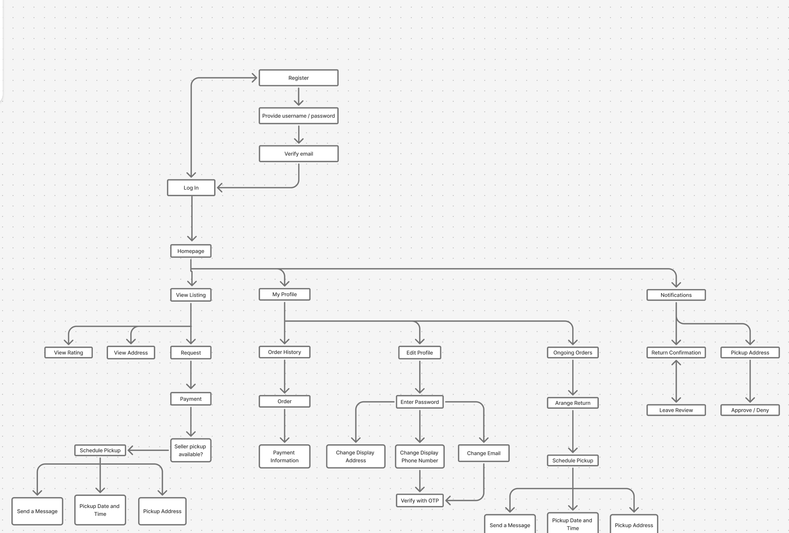
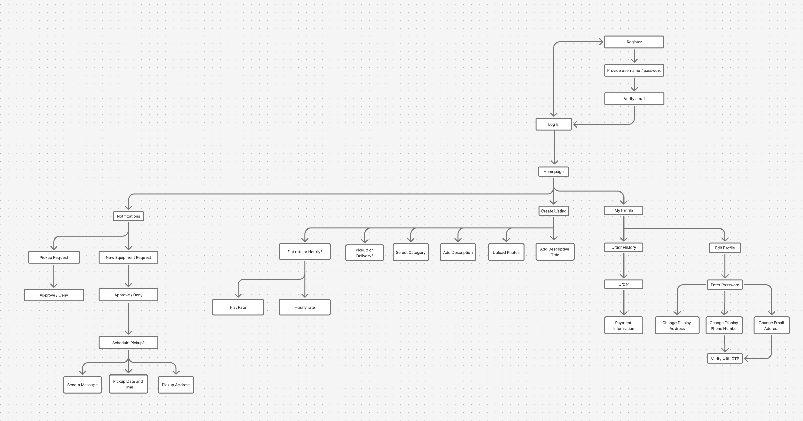

# Specification Phase Exercise

A little exercise to get started with the specification phase of the software development lifecycle. See the [instructions](instructions.md) for more detail.

## Team members

- [Jack Escowitz](https://github.com/JackREscowitz)
- [Diya Greben](https://github.com/diyagreben)
- [Aleks Nuzhnyi](https://github.com/nuzhny25)
- [Faizan Shamsi](https://github.com/17faizan)
- [Howard Xia](https://github.com/hewlett-packard-lovecraft)

## Stakeholders

### George Escowitz - Snow Equipment Lender

#### Goals/Needs
- Wants to be able to have data regarding the people they lend equipment to (Address, phone number, full name, etc).
- Wants a way to post a list of equipment they could lend out, with details like equipment serial number and date of purchase.
- Would like to be able to track history of rent they earned over time.
- Wants to be able to establish a detailed rental agreement and a way to keep track of them.
- Wants to be able to keep track of received payments through notifications and records (How, where, and when it was paid).
- Needs a way to flag customers and differentiate ones with bad history.

#### Problems/Frustrations
- As someone who owns equipment, lending out of goodwill often leads to damages that aren't financially compensated.
- Snow equipment sits in garage unused for most of the year, despite it being a large investment.
- Purchased snow equipment often becomes technologically outclassed in only a couple of years.
- Depreciation over time makes reselling equipment difficult, so its hard to make back money from already purchased equipment. In addition, since it depreciates over time even without usage, there is an incentive to put it to any use whenever possible.

---

### Chandhini Ramaiah - Snow Equipment Renter

#### Goals/Needs
- Quick access to snow removal equipment when it snows.
- Access to affordable snow removal equipment.
- Wants to feel safe and protected when renting tools from strangers.
- App is easy to use for those who aren't tech savvy.
- The equipment is of good quality and will not break.

#### Problems/Frustrations
- Traditional snow shoveling is physically taxing and sometimes dangerous, especially as an older adult.
- Apps are often confusing and difficult to use as an older adult.
- Snow does not occur year round. It is not financially worth it to purchase expensive snow removal equipment that will only be used a handful of times a year.
- During peak snow seasons, snow removal equipment is hard to obtain in immediate situations.
- It is uncomfortable asking neighbors to borrow their snow equipment, especially during times when the neighbors also need to use it. 

## Product Vision Statement

Our goal with this application is to build a reliable and easy-to-use platform that connects snow equipment owners with renters in need of it, allowing owners to monetize underused equipment while giving renters affordable and trusted access to tools verified through transparent agreements, reviews, and administrative oversight.

## User Requirements

### Snow Equipment Lender

#### Account Specification
- As a Snow Equipment Lender, I want to create an account with a username and password, so that I can lend equipment through the platform.
- As a Snow Equipment Lender, I want to attach contact information (phone number or email) to my account, so that Renters can communicate with me off the app.
- As a Snow Equipment Lender, I want to attach a location to my account, so that Renters can see whether my equipment is nearby.
- As a Snow Equipment Lender, I want to have a public five-star review score, so that my reliability is visible to potential Renters.

#### Searching and Viewing
- As a Snow Equipment Lender, I want to browse and search equipment by location, type, price, and review score, so that I can see what my competition is offering.

#### Equipment Posting
- As a Snow Equipment Lender, I want to list equipment with details such as type, serial number, and date of purchase, so that Renters understand what they are renting.
- As a Snow Equipment Lender, I want to set rental pricing (hourly, daily, or flat rate), so that Renters understand the cost beforehand.
- As a Snow Equipment Lender, I want to specify whether equipment requires pickup or can be delivered, so that logistics are clear before an agreement.
- As a Snow Equipment Lender, I want to add or remove equipment listings, so that my available offerings remain accurate.

#### Requests and Agreements
- As a Snow Equipment Lender, I want to receive notifications when a Renter requests my equipment, so that I can respond promptly.
- As a Snow Equipment Lender, I want to confirm or reject rental requests, so that I maintain control over who rents my equipment.
- As a Snow Equipment Lender, I want confirmation of a rental to trigger payment handling, so that transactions are processed automatically.
- As a Snow Equipment Lender, I want confirmed rental agreements to be stored in the app, so that they can be referenced later.

#### Payments and Records
- As a Snow Equipment Lender, I want to attach a bank account, so that I can receive rental payments.
- As a Snow Equipment Lender, I want to see a private earnings history per piece of equipment, so that I can track profitability.
- As a Snow Equipment Lender, I want to view payment records with time and method, so that I can maintain accurate financial records.

---

### Snow Equipment Renter

#### Account Specification
- As a Snow Equipment Renter, I want to create an account with a username and password, so that I can rent equipment.
- As a Snow Equipment Renter, I want to attach contact information (phone number or email), so that I can communicate with Lenders off the app.
- As a Snow Equipment Renter, I want to attach a bank account, so that payments can be handled through the platform.
- As a Snow Equipment Renter, I want to have a public five-star review score, so that Lenders can evaluate my rental history.

#### Searching and Viewing
- As a Snow Equipment Renter, I want to browse and search equipment by location, type, price, and review score, so that I can find suitable options.
- As a Snow Equipment Renter, I want to view detailed equipment listings, so that I can evaluate reliability.
- As a Snow Equipment Renter, I want to see whether equipment requires pickup or delivery, so that I can plan logistics.
- As a Snow Equipment Renter, I want to view the Lender’s review score, so that I can assess trustworthiness.

#### Requests and Agreements
- As a Snow Equipment Renter, I want to request a specific piece of equipment, so that I can initiate a rental agreement.
- As a Snow Equipment Renter, I want to specify rental duration, so that pricing is clear.
- As a Snow Equipment Renter, I want to receive notifications when a request is accepted or rejected, so that I can respond accordingly.
- As a Snow Equipment Renter, I want confirmed rental agreements to be stored in the app, so that I can reference them later.

#### Payments and Records
- As a Snow Equipment Renter, I want payments to be handled through attached bank accounts, so that transactions are secure.
- As a Snow Equipment Renter, I want to see payment records including date and method, so that I can track expenses.
- As a Snow Equipment Renter, I want to view my rental history, so that I can reference past agreements.

## Activity Diagrams

### Snow Equipment Renter

- As a Snow Equipment Renter, I want to create an account with a username and password, so that I can rent equipment.
- As a Snow Equipment Renter, I want to attach contact information (phone number or email), so that I can communicate with Lenders off the app.
- As a Snow Equipment Renter, I want to view detailed equipment listings, so that I can evaluate reliability.
- As a Snow Equipment Renter, I want to see whether equipment requires pickup or delivery, so that I can plan logistics.
- As a Snow Equipment Renter, I want to view the Lender’s review score, so that I can assess trustworthiness.

- As a Snow Equipment Lender, I want to create an account with a username and password, so that I can lend equipment through the platform.
- As a Snow Equipment Lender, I want to attach contact information (phone number or email) to my account, so that Renters can communicate with me off the app.
- As a Snow Equipment Lender, I want to attach a location to my account, so that Renters can see whether my equipment is nearby.
- As a Snow Equipment Lender, I want to have a public five-star review score, so that my reliability is visible to potential Renters.
- As a Snow Equipment Lender, I want to set rental pricing (hourly, daily, or flat rate), so that Renters understand the cost beforehand.
- As a Snow Equipment Lender, I want to specify whether equipment requires pickup or can be delivered, so that logistics are clear before an agreement.
- As a Snow Equipment Lender, I want to add or remove equipment listings, so that my available offerings remain accurate.

## Clickable Prototype

[Prototype Link](https://www.figma.com/proto/MrjMAzSEakAHVmU3eFXDcD/Griffins-Wireframe?node-id=12-2&p=f&t=0KXdLUapamwKAmaw-1&scaling=scale-down&content-scaling=fixed&page-id=0%3A1&starting-point-node-id=12%3A2)
